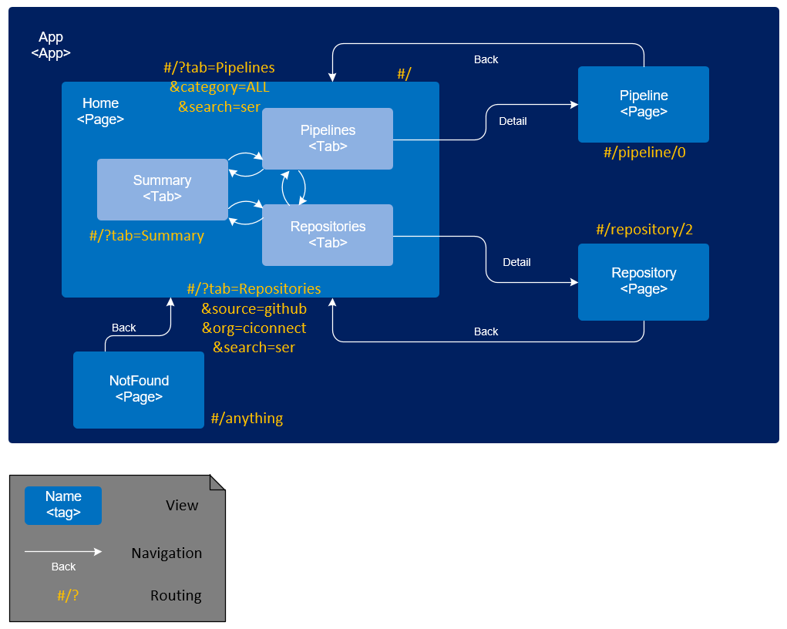

# Pipeline-UI-PoC

 * Install this node project, following things are triggered by this command
 	* install all dependencies.
	* download blue ocean design language project via bower
	* build translate blue ocean control in JSX+ES6 to ES5 in format of AMD module bundle
	* translate blue ocean LESS to CSS, and wrap it with 'jenkinsbo' namespace
	* copy blue ocean svg files
``` sh
npm install
```

 * Run an HTTP server
``` sh
npm start
```
 * Access by link [http://localhost:76547/openui5-react-poc/public](http://localhost:7654/openui5-react-poc/public)

Design
--------------
 * Structure, Transition and Routing of views:
 
 * Wrapper of React control: **sap.ciconnect.control.BOControl**. This is a general wrapper. Any control provided by blue ocean can be used via this wrapper. Only specify following things:
 	* properties:
 		* **moduleName**: name of the module (file) under dist/bo/js. For example: PipelineGraph.
 		* **controlName**: name of the control. One module is possible to export several controls. For example: weather-icon module contains several controls.
 		* **props**: This is an object of react property. In general data is fed here. Please refer to blue ocean modules (under folder bower_components/jenkins-design-language/src/js/components) for props detail.
 	* aggregations:
 		* **boEvents**:react control event is impelemented in here. Because BOControl is a general wrapper, event names cannot be predefined in event{} block. So this multiple aggregation is defined to wrap events. For each event defined by react control, add an aggregation instance of BOEvent, simply specify event name and provide handler would work.
 	Example:
 ``` xml
<ci:BOControl moduleName="PipelineGraph" controlName="PipelineGraph" props="{pipeline>abstract}">
	<ci:boEvents>
		<ci:BOEvent name="onNodeClick" handle="onPipelineNodeClick" />
	</ci:boEvents>
</ci:BOControl>
```	

Useful links
--------------
* Octicons list: [https://octicons.github.com/](https://octicons.github.com/)
* Fontawesome icon list: [http://fontawesome.io/icons/](http://fontawesome.io/icons/)
* Jenkins Design Language controls: [http://jenkinsci.github.io/jenkins-design-language/docs](http://jenkinsci.github.io/jenkins-design-language/docs)

Todos
--------------
- [x] use requirejs to integrate amd bo to ui5.
- [x] Ref to this article: [http://www.ryadel.com/en/css-namespaces-avoid-conflict-style-sheets-files/](http://www.ryadel.com/en/css-namespaces-avoid-conflict-style-sheets-files/), create own LESS and add namespace to avoid conflict of BO css and UI5 css.
- [x] adjust data to support both d3 pipeline and new bo pipeline control.
- [x] adjust summary page, use weather icons instead of ui5 control.
- [x] remove vscroll bar on app level (overflow: hidden)
- [x] move vscroll bar from view level on to list level
- [x] add a category dropdown in front of search on pipeline page (e.g. Fiori standard pipeline)
- [x] enhance search function of pipeline page
- [x] add an organization + git/gerrit + all selection dropdown in front of search on repo page.
- [x] enhance search function of repo page
- [x] finish delete git repo pop
- [x] finish active button pop - consume the new models
- [x] finish deactive button pop - consume the new models
- [x] move add git input to a pop triggered by popover
- [x] mix github/gitgerrit tables
- [x] change repo view to bage style, line items become like link + bages + pipelinegraph
- [x] change pipeline view to bage style, line items become like link + bages + pipelinegraph
- [x] linkage / event navigation of repo/pipeline page
- [x] add navigation function to pipeline page list items, a page to edit pipeline, and see more details about it
- [x] add navigation function to repo page list items, a page to see more detail of running status
- [x] add bookmarkable tab
- [x] add bookmarkable search
- [x] event handling of BOControl in general
- [ ] deploy to cf
- [ ] knowledge transfer of poc 
- [ ] know-how to department (19th Dec.  1h)
- [x] detail page of repo (use children data of BO pipelinegraph control)
- [x] detail page of repo (use control sap.uxap.ObjectPageLayout and forms)
- [ ] embed BOControl in BOControl (use page & page-header controls)
- [ ] detail page of pipeline (use BOControl container features)
- [ ] legend page
- [ ] add db (json-based)
- [ ] integrate with real system (odata ? json ?)
- [ ] detail page of pipeline (use pipeline editor control, comming soon by jenkins DL)
