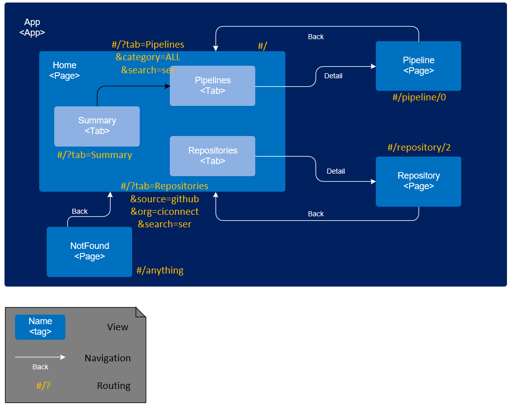

Steps to set up openui5-react PoC (4/4)
--------------
Prerequisite: nodeJS is installed

 * Download dependencies. Blue ocean design language will be downloaded by bower while others are referenced as node module.
```sh
npm run installAll
```
 * Run gulp to generate folder /dist
```sh
npm run gulp
```
In this step, following things are performed in /dist folder:
	1. build translate blue ocean control in REACT+ES6 to ES5 in amd module format
	2. translate blue ocean LESS to CSS, and wrap it with .jenkinsbo namespace
	3. copy blue ocean svg files

 * Run an HTTP server, middleware are installed in this js.
```sh
node server.js
```
 * Access by link [http://localhost:76547/openui5-react-poc/public](http://localhost:7654/openui5-react-poc/public)

Design
--------------
 * Structure, Transition and Routing of views:
 

Useful links
--------------
* Octicons list: [https://octicons.github.com/](https://octicons.github.com/)
* Fontawesome icon list: [http://fontawesome.io/icons/](http://fontawesome.io/icons/)
* Jenkins Design Language controls: [http://jenkinsci.github.io/jenkins-design-language/docs](http://jenkinsci.github.io/jenkins-design-language/docs)

Todos
--------------
- [x] use requirejs to integrate amd bo to ui5.
- [x] Ref to this article: [http://www.ryadel.com/en/css-namespaces-avoid-conflict-style-sheets-files/](http://www.ryadel.com/en/css-namespaces-avoid-conflict-style-sheets-files/), create own LESS and add namespace to avoid conflict of BO css and UI5 css.
- [x] adjust data to support both d3 pipeline and new bo pipeline control.
- [x] adjust summary page, use weather icons instead of ui5 control.
- [x] remove vscroll bar on app level (overflow: hidden)
- [x] move vscroll bar from view level on to list level
- [x] add a category dropdown in front of search on pipeline page (e.g. Fiori standard pipeline)
- [x] enhance search function of pipeline page
- [x] add an organization + git/gerrit + all selection dropdown in front of search on repo page.
- [x] enhance search function of repo page
- [x] finish delete git repo pop
- [x] finish active button pop - consume the new models
- [x] finish deactive button pop - consume the new models
- [x] move add git input to a pop triggered by popover
- [x] mix github/gitgerrit tables
- [x] change repo view to bage style, line items become like link + bages + pipelinegraph
- [x] change pipeline view to bage style, line items become like link + bages + pipelinegraph
- [x] linkage / event navigation of repo/pipeline page
- [x] add navigation function to pipeline page list items, a page to edit pipeline, and see more details about it
- [x] add navigation function to repo page list items, a page to see more detail of running status
- [x] add bookmarkable tab
- [x] add bookmarkable search
- [x] event handling of BOControl in general
- [ ] detail page of pipeline (use children data of BO pipelinegraph control)
- [ ] detail page of repo (use BO control)
- [ ] legend page
- [ ] adjust css to be more close to blue ocean theme
- [ ] add db (json-based)
- [ ] integrate with real system